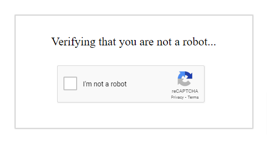

# MobileBERT를 활용한 IHERB 영양제 리뷰 분석 프로젝트

---

---

## 1. 개 요

나는 해외 직구 사이트에서 영양제를 사 먹는 편이다. 그런데 제품을 보다가 대부분의 제품은 리뷰가 5점에 가깝지만, 5점을 주면서 부정적인 말을 하는 사람이 적지 않게 보인다.
나는 어떤 제품의 리뷰를 볼 때 별점이 낮은 것부터 본다. 그 이유는 대부분의 리뷰는 5점을 많이 주기 때문에 부정적인 리뷰들의 비판적인 내용이 제품을 좀 더 객관적으로 판단할 수 있게 하는 기준이 되기 때문이다.
5점짜리 리뷰가 많으면 의심되기도 하고, 뭔가 손이 안 간다. 하지만 실제로 사람들이 제품에 대해 부정적인 평가를 잘 안 하는지 궁금해졌다.
따라서 리뷰를 분석하여 베스트셀러인 영양제들은 대부분 긍정적인 리뷰가 많지만, 5점과 4점짜리 리뷰에도 부정적인 리뷰가 있는지 알아보고 싶어서 이 주제를 선정하게 되었다.

이번 프로젝트를 시작하기 전에 iHerb라는 사이트에 대해 알아볼 필요가 있다. iHerb는 1996년 설립된 미국의 전자상거래 기업으로, 건강기능식품 및 웰빙 제품을 전문적으로 판매한다. 한국을 포함한 전 세계 180여 개국에 제품을 배송하는 글로벌 유통망을 갖추고 있다.
또한 국내에서 접하기 어려운 고함량 비타민이나 여러 건강보조식품을 해외 직구 할 수 있다. 나도 영양제에 관심을 가지게 되면서 iHerb를 알게 되었는데, 우리나라에서도 영양제에 대해 관심이 있으면 한 번은 듣게 되는 사이트다. 다만 의약품으로 분류되는 것은 팔지 않으며, Herb라는 이름 그대로 식품과 의약품 사이의 "기능성" 식품이나 보충제, 이/미용 제품 등을 판매하는 사이트이다.

요즘 부쩍 건강에 관심이 많아진 만큼 사람들이 영양제에도 관심이 많다. 영양제는 몸에 영향을 주기 때문에 리뷰를 잘 보고 살 수밖에 없는데, 리뷰에서 제품에 대한 정확한 평가가 없으면 제품을 살 때 많은 고민이 든다. 따라서 이 프로젝트가 어떤 제품을 살 때 제품의 장단점을 명확히 알기 위한 기준이 되었으면 한다.

## 2. 데이터 수집
처음에는 데이터를 수집하기 위해 AI의 도움을 받아 iHerb 사이트 안에서 브라우저 화면을 직접 조작하여 크롤링하는 형식을 사용했다.
내가 원하는 리뷰 데이터는 각 제품당 20,000개 정도였고, 20,000개의 리뷰 데이터를 라벨링하여 2,000개 정도로 축소해 MobileBERT의 학습 데이터로 사용할 예정이었다.
그러나 여기서 문제가 생겼다. iHerb 리뷰 페이지는 한 페이지당 20개의 리뷰 데이터가 존재하는데 100페이지 정도를 넘길 때쯤에 Cloudflare에서 봇으로 인식하여 사이트 접속을 차단했다.
그래서 50페이지마다 저장하고 다시 이어서 크롤링하는 방식으로 코드를 짜서 시도해 봤지만, 쿠키 데이터가 생성되면서 사이트 접속 자체가 막혔다.
### 페이지 예시

  

그래서 매번 시도할 때마다 이런 페이지가 떴었고 통과하지 못하고 꺼졌었다. 따라서 파이참 안에 있는 쿠키 데이터를 지우고 실행했지만, 이미 나를 봇으로 인식했는지 파이참으로 실행하면 아예 404가 떠서 사이트 접속 자체를 막았다.
집에서 막히다가 학교에서 시도했을 때에는 같은 코드인데 사이트가 들어가지는 걸 보니 집 IP가 임시 차단당한 것 같았다.

AI한테 물어봐서 코드를 고쳐보기도 했지만 해결은 되지 않았고 AI는 Kaggle의 오픈 데이터를 추천했다. 그래서 Kaggle에 들어가서 데이터를 구해보려고 서치를 해봤지만 내가 원하는 iHerb 리뷰 데이터는 존재하지 않았다. 그래서 이번에는 리뷰 데이터를 주는 서버 API에 바로 요청하여 데이터를 수집하는 방식을 사용했다.
이렇게 하면 직접 브라우저에서 크롤링하는 것보다 서버에 무리를 주지 않고 봇으로 의심받을 확률이 낮아 좀 더 안전하게 데이터를 수집할 수 있었다.

이렇게 수집한 데이터의 양은 제품당 약 9,000개 정도이고 총 데이터의 양은 43,500개 정도이고 기간은 출시부터 2026년 6월 20일까지 수집했다. 각 제품당 리뷰 20개씩 500페이지를 수집하였지만 8,400~9,200정도 제품마다 다르게 데이터가 수집되었는데, 크롤링하는 과정에서 일부 리뷰가 본문이 없거나 API 서버에서 가져오는 과정에서 일부가 사라진 것으로 확인된다.
또한 리뷰를 더 수집해보려 했으나 501페이지부터 접근이 안 되는 상황이 발생했다. AI에게 물어봤으나 500페이지를 넘기면 리뷰 데이터를 못 불러오게 차단한 것 같다고 설명해 줬다. 하지만 10,000개 정도에 가까운 데이터이기 때문에 지금 받은 데이터를 더 수집하지 않고 라벨링하여 사용하기로 결정했다.

### 수집한 데이터의 형태.
| page | review_title                  | review_text                                                                    | rating |
|------|-------------------------------|--------------------------------------------------------------------------------|--------|
| 1    | omega 3                       | I like California gold products so much. This omega 3 has no fish taste ...... | 5.0    |
| 1    | Reduce The Chronic Disease    | Omega-3 premium fish oil offers a range of health benefits......               | 5.0    |

## 3. 학습데이터 구축
이제 수집한 데이터를 라벨링하여 학습 데이터를 만들어야 하는데 문제가 생겼다. 수집한 데이터의 긍정 부정을 나누어 긍정적인 요소와 부정적인 요소를 알아보려고 하는 도중에
수집한 데이터를 살펴보니 전체 데이터중 별점이 1점과 2점인 리뷰는 합쳐서 많아야 50개 적으면 20개정도 밖에 없었다. 약 9000개의 데이터에서 50개정도가 부정적인 리뷰라면
부정적인 데이터가 학습데이터로 사용하기에는 턱없이 부족한 양이기 때문에 1점과 2점인 리뷰를 따로 수집하는 코드인 api_collect_low_rating.py를 이용하여 제품당 약 3500개 정도의
리뷰 데이터를 따로 수집하였다.

학습 데이터 구축을 위해 수집한 전체 리뷰 데이터에서 1점과 2점 데이터는 따로 수집하였으므로 지워주고 라벨링하여 라벨링한 1점과 2점 리뷰 데이터를 합쳐서 분석 대상 데이터로 사용했다.
또한 리뷰 데이터의 긍정과 부정 비율은 1:1로 구축하였고 별점 중립인 3점을 제외한 1~5점의 비율은 각 1:1:1:1로 설정하였다.
분석 대상 데이터는 총 3000개이고 분석 대상 데이터는 null값이 아니며 영어인 데이터만 사용하였다. 리뷰가 너무 짧아도 데이터의 질이 떨어진다고 생각해서 리뷰는 10단어 이하의 문장은 분석 대상 데이터에서 제외 하였다.

### 3-1. 라벨링 결과

- 라벨링 결과의 일부 예시    

| product_id | product_name | rating | review_title |review_text| word_count |                                                                                                                                                       text | label |   sentiment |
|-----------:|-------------:|-------:|-------------:|---:|-----------:|-----------------------------------------------------------------------------------------------------------------------------------------------------------:|------:|------------:|
|      64009 |     LactoBif |      1 |  never again |"it caused me constipation. so instead of good effect, it only caused problems. really disappointed"|         15 |                                           "never again it caused me constipation. so instead of good effect, it only caused problems. really disappointed" |     0 |    negative |
|      61865 |     VitaminC |      5 |   Good value |Product is authentic! Also great value for money. Cheaper than other products with same effect. Used this at the start of flu/cold. Seems okay.|         24 | Good value Product is authentic! Also great value for money. Cheaper than other products with same effect. Used this at the start of flu/cold. Seems okay. |     1 |    positive 
이처럼 라벨링한 데이터를 살펴보면 긍정적인 리뷰는 긍정적인 단어인 good, great같은 단어가 많이 보여 구분하기 쉬울거 같다고 느꼈지만
부정적인 리뷰에 부정적인 단어인 disappointed나 never again같은 단어가 있음에도 불구하고 내용에는 good effect같은 긍정적인 단어도 포함되어 있는경우도 있어서 모델이 잘 구분할지 걱정이 되었다.

## 4. MobileBERT 모델 학습
    === 학습 및 검증 결과 ===
    - 데이터는 라벨링한 데이터 3000개이고 검증은 8:2인 test_size=0.2 으로 설정하여 학습하였다.
| Epoch | 학습오차 | 학습정확도 | 검증정확도 |
|---:|---:|---:|---:|
| Epoch 1 | 65078.1618 | 0.9100 | 0.8783 |
| Epoch 2 | 0.3095 | 0.9450 | 0.8917 |
| Epoch 3 | 0.4712 | 0.9587 | 0.8933 |
| Epoch 4 | 0.2411 | 0.9654 | 0.8967 |

### 4-1. 전체 데이터에 대한 MobileBERT 모델 학습
전체 데이터에 대한 모델의 성능을 확인해 보고싶어서 학습된 모델로 전체 리뷰의 긍정과 부정을 예측해보고 싶어서 9000개의 데이터가 있는 iherb_reviews_16567_mg.csv의 전체 데이터를 사용하여 예측을 해보았다.

학습이 완료된 MobileBERT 모델을 사용하여  
`iherb_reviews_16567_mg.csv`의 전체 리뷰에 대한 감성 예측을 수행하였다.

### 4_2. 예측 결과 요약

| 예측 감성 | 리뷰 수 | 비율 | 평균 예측 확률 |
|---:|---:|---:|---:|
| 부정 | 706 | 7.78% | 0.8921 |
| 긍정 | 8,365 | 92.22% | 0.9882 |

- 전체 예측 리뷰 수: **9,071건**
- `0`: 부정 리뷰
- `1`: 긍정 리뷰

### 긍정 리뷰 예측 사례

| 리뷰 내용 | 예측 확률 |
|---|---:|
| Great product to help with my magnesium intake. Easy to take | 1.0 |
| Bery good nice , wowwwwwwwww Beautiful Bery good nice , wowwwwwwwww Beautiful Bery good nice , wowww... | 1.0 |
| thank you very match iherb is realllly the pic dmkdlm dkdndn eodnnr | 1.0 |
| Doctor’s Best High Absorption Magnesium with Albion TRAACS is the best for deep relaxation, restful ... | 1.0 |
| Great quality. Helps me sleep well at night. No stomach issues just good relaxation | 1.0 |

### 부정 리뷰 예측 사례

| 리뷰 내용 | 예측 확률 |
|---|---:|
| I don't know the reason, but this formula causes stomach ache for me. On the beginning I was thinkin... | 1.0 |
| I heard this helps fibro but it made me sicker so I did not take them. Maybe you will have a diff ex... | 1.0 |
| I did not sleep well at all last night. I thought this type of magnesium supplement works on improvi... | 1.0 |
| I ordered these to replace a more expensive magnesium supplement, but I didn't realised they would b... | 1.0 |
| the capsule is too big for me I remember I got chocked twice from taking them I wouldn't buy it agai... | 1.0 |

예측 확률은 모델이 해당 리뷰를 긍정 또는 부정으로 분류한 확신 정도를 의미한다.

## 5. 문제제기에 대한 결과
| 예측 감성 | 리뷰 수 | 비율 | 평균 예측 확률 |
|---:|---:|---:|---:|
| 부정 | 706 | 7.78% | 0.8921 |
| 긍정 | 8,365 | 92.22% | 0.9882 |

- 전체 예측 리뷰 수: **9,071건**

4-2의 결과를 보면 부정이 706개고 긍정이 8365개로 분류되었다. 하지만 `iherb_reviews_16567_mg.csv`데이터 안에는 1점과 2점을 준 리뷰는 각 12개 11개이며 3점짜리 리뷰를 포함하더라도 128개밖에 안되므로
1~3점을 준 사람들은 151명 정도인데 부정으로 판단된 리뷰는 706개이다. 이 결과는 4점과 5점을 준 사람들 중에도 부정적인 리뷰를 쓴 사람이 있다는 말이기도 하다. 그렇다고 이게 무조건적인 말은 아닌게 평균 예측 확률을 보면 긍정은 0.9882 이지만 부정은 0.0961차이인 0.8921이므로
예측이 틀릴 가능성도 있다.

## 6. 느낀점 및 개선방향

 처음에 이 프로젝트를 생각하게 된건 쇼핑몰의 과대 광고와 리뷰 이벤트와 같은 행사때문에 리뷰의 신뢰성을 알아보고자 시작했다.
결과를 보니 생각보다 많은 사람들이 부정적인 평가는 말해도 리뷰 점수는 높게주는 경향이 있는거 같다. 아쉬웠던점은 중립을 따로 넣었더라면 좀 더 정확한 분석이 가능하지 않았을까라는 생각이 든다.
다음에는 중립을 넣어서 더 정확한 분석을 해보고 싶은 생각이 든다.

## 데이터 출처 및 이용 안내

본 프로젝트에서 사용한 리뷰 데이터는 **iHerb 상품 리뷰 페이지**에서 수집하였습니다.

* 데이터 출처: iHerb
* 수집 대상: 건강기능식품 5개 제품의 공개 사용자 리뷰
* 활용 목적: MobileBERT 기반 리뷰 감성 분류 및 긍정·부정 요인 분석
* 수집 항목: 리뷰 제목, 리뷰 내용, 별점
* 라벨 기준: 별점 1~2점은 부정, 별점 4~5점은 긍정으로 분류

수집된 데이터는 학습 및 포트폴리오 제작 목적으로만 사용하였으며, 리뷰의 저작권은 원문 작성자와 해당 플랫폼에 있습니다. 본 프로젝트는 iHerb와 공식적인 관련이 없습니다.
